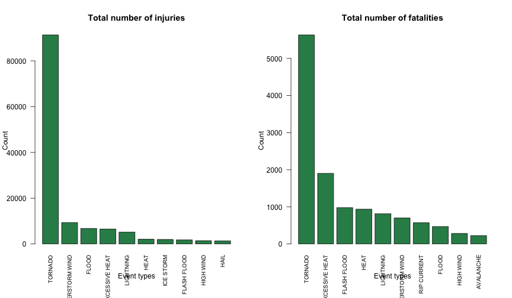
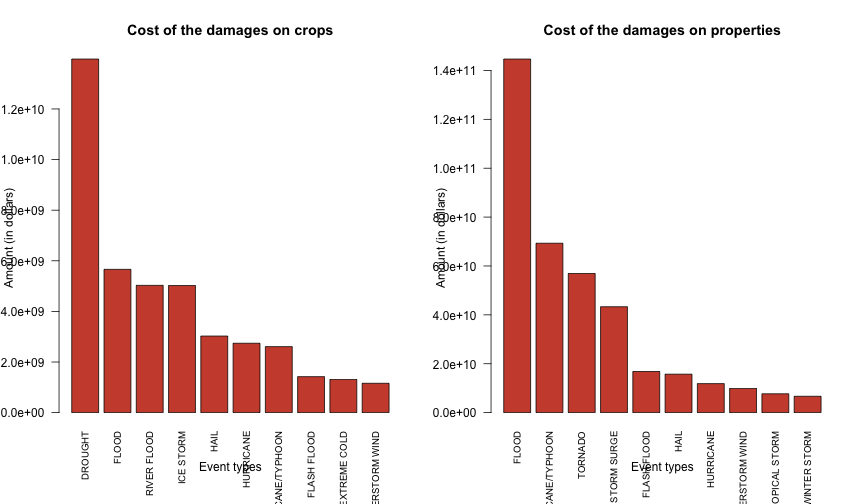

# Consequences of severe weather events on public health and economy in the U.S between 1950 and 2011


## Synopsis

This report aims to quantify the damages on population and the economic cost 
of severe weather events in the United-States.
In particular, we wanted to know what types of events are the most harmful on
population and what types of events had the greatest economic impacts.
In order to answer these questions, we analyzed the U.S.
National Oceanic and Atmospheric Administration's (NOAA) storm database. This
database tracks characteristics of major storms and weather events in the
United States, including when and where they occur, as well as estimates of any
fatalities, injuries, and property damage. The dataset we used, [Storm data][storm_data], 
gathered all these information between 1950 and 2011.
From these data, we were able to determine that tornadoes caused the most
injuries and fatalities on population. From the economic perspective, droughts had the 
greatest impacts on crops and floods had the greatest impacts on properties. 


## Data processing

### Loading and preprocessing of the raw data

We load the Storm data from the unzipped file downloaded from the U.S National
Oceanic and Atmospheric Administration's (NOAA) storm database.


```r
storm <- read.csv("repdata-data-StormData.csv")
dim(storm)
```

```
## [1] 902297     37
```

```r
head(storm, 3)
```

```
##   STATE__          BGN_DATE BGN_TIME TIME_ZONE COUNTY COUNTYNAME STATE
## 1       1 4/18/1950 0:00:00     0130       CST     97     MOBILE    AL
## 2       1 4/18/1950 0:00:00     0145       CST      3    BALDWIN    AL
## 3       1 2/20/1951 0:00:00     1600       CST     57    FAYETTE    AL
##    EVTYPE BGN_RANGE BGN_AZI BGN_LOCATI END_DATE END_TIME COUNTY_END
## 1 TORNADO         0                                               0
## 2 TORNADO         0                                               0
## 3 TORNADO         0                                               0
##   COUNTYENDN END_RANGE END_AZI END_LOCATI LENGTH WIDTH F MAG FATALITIES
## 1         NA         0                      14.0   100 3   0          0
## 2         NA         0                       2.0   150 2   0          0
## 3         NA         0                       0.1   123 2   0          0
##   INJURIES PROPDMG PROPDMGEXP CROPDMG CROPDMGEXP WFO STATEOFFIC ZONENAMES
## 1       15    25.0          K       0                                    
## 2        0     2.5          K       0                                    
## 3        2    25.0          K       0                                    
##   LATITUDE LONGITUDE LATITUDE_E LONGITUDE_ REMARKS REFNUM
## 1     3040      8812       3051       8806              1
## 2     3042      8755          0          0              2
## 3     3340      8742          0          0              3
```

The the Storm data contains 902297 rows and 37 columns.

* Dates

We format properly the columns `BGN_DATE` and `END_DATE`:


```r
storm$BGN_DATE <- as.Date(as.character(storm$BGN_DATE), "%m/%d/%Y")
storm$END_DATE <- as.Date(as.character(storm$END_DATE), "%m/%d/%Y")
```


* Event types

A quick look at the event types revealed many inconsistencies in the naming. 
This can be explained by the fact that the dataset covers a wide period (61 years)
and has been updated by different people with different conventions.

For example we find values like `'THUNDERSTORM'`, `'THUNDERSTORMS'` or 
`'TSTM WIND'`, `'THUNDERSTORM WIND'`, `'THUNDERSTORM WIND 59'`
and `'THUNDERSTORM WIND 59 MPH.'` (and even `'THUNDERSTORM WINS'`). 

In this analysis, we make a few assumptions:  

* singular and plural terms are identical  

* uppercase and lowercase are identical  

* some words are shortened


```r
endswith <- function(x, pattern) {
    grepl(paste0(pattern, "$"), x)
}

singularize <- function(name) {
    name <- as.character(name)
    if (endswith(tolower(name), "s")) {
        singular <- substr(name, 1, nchar(name)-1)
    }
    else {
        singular <- name
    }
    return(singular)
}

# Plural to singular
event_types <- sapply(storm$EVTYPE, singularize)
# All the event types are uppercase
event_types <- toupper(event_types)
# TSTM to THUNDERSTORM
event_types <- gsub("TSTM", "THUNDERSTORM", event_types)
# WND to WIND
event_types <- gsub("WND", "WIND", event_types)
storm$EVTYPE <- event_types
```

## Results

The following results were obtained with functions from the base package and
the `dplyr` package.


```r
suppressMessages(library(dplyr))
```


### The most harmful events with respect to population health

In this section we focus on the consequences of the weather events on the
population health. In particular we'll set a ranking of the most harmful events
designated by the variable `EVTYPE`. 

In order to have an idea of what types of events are recorded here are the 
10 first most frequent event types:


```r
head(rev(sort(table(storm$EVTYPE))), 10)
```

```
## 
##              HAIL         TSTM WIND THUNDERSTORM WIND           TORNADO 
##            288661            219946            103406             60653 
##       FLASH FLOOD             FLOOD         HIGH WIND         LIGHTNING 
##             54309             25329             21745             15754 
##        HEAVY SNOW        HEAVY RAIN 
##             15708             11749
```

The variables of interest to determine which types of events are most harmful
with respect to health population are the `INJURIES` and `FATALITIES`. 
The following code computes the total injuries and fatalities grouped by event 
types and sorted in descending order:


```r
injuries <- storm %>% group_by(EVTYPE) %>% summarise(total=sum(INJURIES)) %>% arrange(-total)
fatalities <- storm %>% group_by(EVTYPE) %>% summarise(total=sum(FATALITIES)) %>% arrange(-total)
```

We plot the 10 event types that respectively caused the most injuries and 
fatalities across the U.S:


```r
par(las=2, mfcol = c(1, 2), mar=c(6.1, 4.1, 4.1, 2.1))

barplot(head(injuries$total, 10), names.arg = head(injuries$EVTYPE, 10), 
        horiz = FALSE, cex.names = 0.8, col="seagreen", main="Total number of injuries",
        xlab="Event types", ylab="Count")

barplot(head(fatalities$total, 10), names.arg = head(fatalities$EVTYPE, 10), 
        horiz = FALSE, cex.names = 0.8, col="seagreen", main="Total number of fatalities",
        xlab="Event types", ylab="Count")
```

 

From these plots, we see that tornadoes are the weather events that caused the
most injuries and fatalities between 1950 and 2011 across the U.S. 
If we consider injuries, the 2nd and 3rd most harmful types of events are
respectively thunderstorm winds and floods. In the case of fatalities, the
equivalent are excessive heats and flash floods.


### The types of events that had the greatest economic consequences

In order to determine the economic cost of the different types of events we
use the columns:

* `CROPDMG` and `CROPDMGEXP` that contains the costs of the damages on crops.  
  The cost of crop damage is computed with the following equation: 
  
> cropdmg_cost = CROPDMG * 10^CROPDMGEXP
  
* `PROPDMG` and `PROPDMGEXP` that contains the costs of the damages on properties.  
  The cost of property damage is computed with the following equation: 
  
> propdmg_cost = PROPDMG * 10^PROPDMGEXP

The values in the columns `CROPDMGEXP` and `PROPDMGEXP` contain characters and 
integers. First we set them to uppercase and combine them:


```r
# Set to upper case
storm$CROPDMGEXP <- toupper(storm$CROPDMGEXP)
storm$PROPDMGEXP <- toupper(storm$PROPDMGEXP)

# Take the unique values
cropdmgexp_values <- as.character(unique(storm$CROPDMGEXP))
propdmgexp_values <- as.character(unique(storm$PROPDMGEXP))

# Combine the unique upper case values using union 
exp_values <- union(cropdmgexp_values, propdmgexp_values)
print(exp_values)
```

```
##  [1] ""  "M" "K" "B" "?" "0" "2" "+" "5" "6" "4" "3" "H" "7" "-" "1" "8"
```

Then we convert the characters to the corresponding integer that will be used
as exponents. We can now calculate the cost for crop and property damages and
stores the values in the columns `CROPDMG_COST` and `PROPDMG_COST`:


```r
exp_values_to_integers <- function(x) {
    e <- list(K=3, M=6, B=9, 
              "+"=0, "-"=0, "?"=0, 
              "0"=0, "1"=1, "2"=2, "3"=3, "4"=4, "5"=5, "6"=6, "7"=7, "8"=8, "9"=9)
        
    if (x %in% names(e)) {
            int_value <- e[[x]]
    }
    else {
        int_value <- 0
    }
    return(int_value)
}

calculate_cost <- function(dmg, dmgexp) {
    dmg*10^exp_values_to_integers(dmgexp)
}

storm$CROPDMG_COST = mapply(calculate_cost, storm$CROPDMG, storm$CROPDMGEXP)
storm$PROPDMG_COST = mapply(calculate_cost, storm$PROPDMG, storm$PROPDMGEXP)
```

We group the data by types of events, sum the costs of the crop and property 
damages and sort them in descending order:


```r
crop_damages_cost <- storm %>% group_by(EVTYPE) %>% summarise(total=sum(CROPDMG_COST)) %>% arrange(-total)
prop_damages_cost <- storm %>% group_by(EVTYPE) %>% summarise(total=sum(PROPDMG_COST)) %>% arrange(-total)
```

We plot the 10 event types that had the greatest economic impacts in the U.S:


```r
par(las=2, mfcol = c(1, 2), mar=c(6.1, 4.1, 4.1, 2.1))

barplot(head(crop_damages_cost$total, 10), names.arg = head(crop_damages_cost$EVTYPE, 10), 
        horiz = FALSE, cex.names = 0.8, col="tomato3", main="Cost of the damages on crops",
        xlab="Event types", ylab="Amount (in dollars)")

barplot(head(prop_damages_cost$total, 10), names.arg = head(prop_damages_cost$EVTYPE, 10), 
        horiz = FALSE, cex.names = 0.8, col="tomato3", main="Cost of the damages on properties",
        xlab="Event types", ylab="Amount (in dollars)")
```

 

From these plots, we can see that the 3 types of events that had the greatest
economic impacts on crops were droughts, floods and river floods.
The equivalent on properties are floods, hurricanes/typhoons and tornadoes.


[storm_data]: https://d396qusza40orc.cloudfront.net/repdata%2Fdata%2FStormData.csv.bz2
